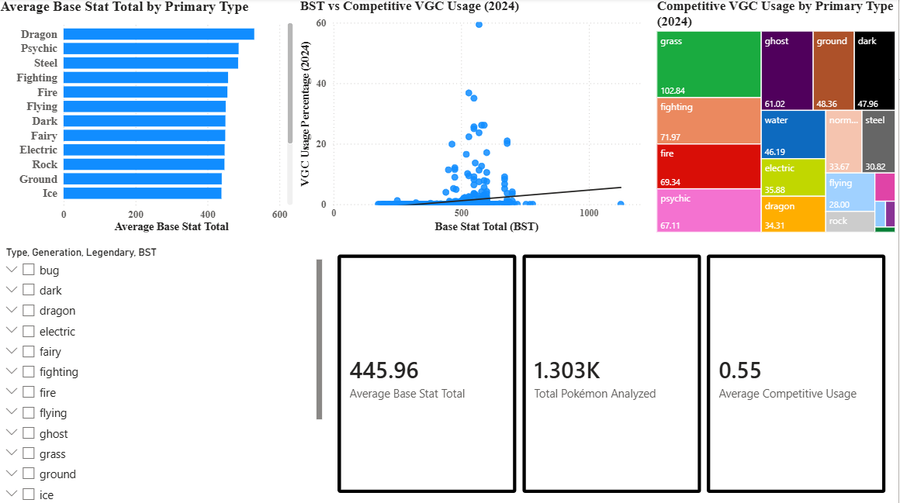
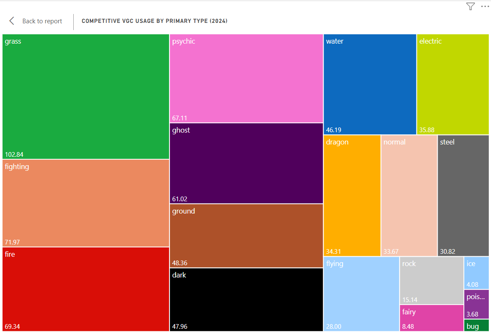

# Competitive Pokemon Analytics

## Dashboard Preview

This project analyzes Pokémon statistics, typing distributions, and competitive VGC usage trends using SQL, Power BI, and Python.

The goal of the project was to apply real-world data analytics techniques to a large gaming dataset while demonstrating skills in data cleaning, visualization design, dashboard development, and analytical storytelling.

## Goals
- Analyze Pokémon base stats and typing
- Explore competitive team-building trends
- Build interactive dashboards in Power BI
- Perform SQL-based data analysis and visualization

## Tools Used
- SQL
- Power BI
- Python
- GitHub

## Dataset

The dataset includes Pokémon species information such as:
- Base stats
- Primary typings
- Competitive VGC usage statistics
- Generation data
- Legendary status

Data was cleaned and transformed prior to visualization and dashboard development.

## Pokemon Count by Primary Type

This visualization shows the distribution of Pokémon primary typings within the dataset. Water and Normal types appear most frequently, while Flying and Fairy are significantly less common as primary typings.

## Average Base Stat Total by Primary Type

This visualization compares the average base stat totals of Pokémon primary typings. Dragon, Psychic, and Steel types show the highest average statistical strength, while Bug and Normal types rank lower overall.

## Goal 1 Summary: Base Stat and Typing Analysis

The first phase of this project focused on analyzing Pokémon base stats and primary typings to identify broader statistical trends across the dataset. 

Initial findings revealed that Water and Normal types appear most frequently as primary typings, while Dragon, Psychic, and Steel types demonstrate the highest average Base Stat Totals (BST). These results suggest that typing frequency does not necessarily correlate with overall statistical strength.

By combining SQL aggregation, Power BI visualizations, and statistical comparisons, this phase established a foundational understanding of Pokémon type distribution and power scaling across the dataset.

With these baseline trends identified, the project will now transition toward competitive team-building analysis, exploring how stat distributions, typings, and role diversity contribute to successful competitive Pokémon teams.

## Research Question
Do Pokémon with higher Base Stat Totals (BST) tend to see greater competitive usage in VGC formats?

## BST vs Competitive VGC Usage (2024)

### Analysis
While higher Base Stat Totals (BST) generally correlate with stronger competitive usage, the relationship is not absolute. Pokémon such as Flutter Mane demonstrate that typing, speed distribution, offensive pressure, and overall team utility can allow moderately statted Pokémon to outperform many statistically stronger alternatives in competitive VGC formats.

An extreme BST outlier was also identified in Eternamax Eternatus (BST 1125). While retained in the dataset for completeness, its unusually high statistical profile was considered separately when interpreting broader competitive trends.

## Research Question
Which Pokémon typings appear most frequently in competitive VGC play?

## Competitive Typing Analysis

The treemap analysis highlights clear differences in competitive VGC representation across Pokémon primary typings. Grass, Fighting, Psychic, Ghost, and Fire types demonstrated the largest cumulative usage percentages within the 2024 metagame, suggesting these typings provide strong offensive pressure, defensive utility, or team synergy in competitive play.

Meanwhile, typings such as Bug, Poison, and Ice maintained significantly lower representation, indicating more specialized or niche competitive roles. Overall, the results suggest that typing plays a major role in competitive viability, influencing both team composition and long-term metagame trends.

## Goal 2 Summary

Goal 2 explored competitive team-building trends within the 2024 Pokémon VGC metagame using historical usage statistics and Power BI visualizations. Analysis of Base Stat Totals (BST) and competitive usage revealed a moderate positive relationship between raw statistical strength and competitive success, while also demonstrating that factors such as typing, speed distribution, abilities, and team utility heavily influence real-world viability.

Additional analysis of competitive type representation showed that certain typings, including Grass, Fighting, Psychic, Ghost, and Fire, maintained strong overall presence within the metagame, suggesting that strategic typing advantages play a major role in competitive team composition.

Overall, the findings demonstrate that successful competitive performance is influenced by a combination of statistical strength, typing synergy, and strategic utility rather than raw power alone.

## Interactive Dashboard Summary

This Power BI dashboard analyzes Pokémon base stats, primary typing, and competitive VGC usage data. The dashboard uses interactive filters for type, generation, legendary status, and BST to allow users to explore how Pokémon performance changes across different categories.

Key insights shown in the dashboard include:

- Dragon, Psychic, and Steel types have some of the highest average Base Stat Totals.
- Higher BST shows a slight positive relationship with VGC usage, but the scatter plot shows that stats alone do not determine competitive success.
- Some lower-BST Pokémon still achieve strong usage, suggesting that typing, abilities, role compression, speed, and team utility are important competitive factors.
- The treemap highlights which primary types had the strongest overall VGC usage in 2024.
- KPI cards summarize the dataset using average BST, total Pokémon analyzed, and average competitive usage.

Overall, this dashboard demonstrates how raw stats, typing, and competitive usage can be combined to better understand Pokémon performance trends.

## Future Improvements

- Integrate advanced SQL querying workflows
- Expand competitive analysis across multiple generations
- Add Python-based statistical modeling
- Publish the dashboard through Power BI Service
- Incorporate win-rate and tournament placement data

## Author

Created by Jesse Luffman  
Aspiring Data Analyst | Power BI | SQL | Python
