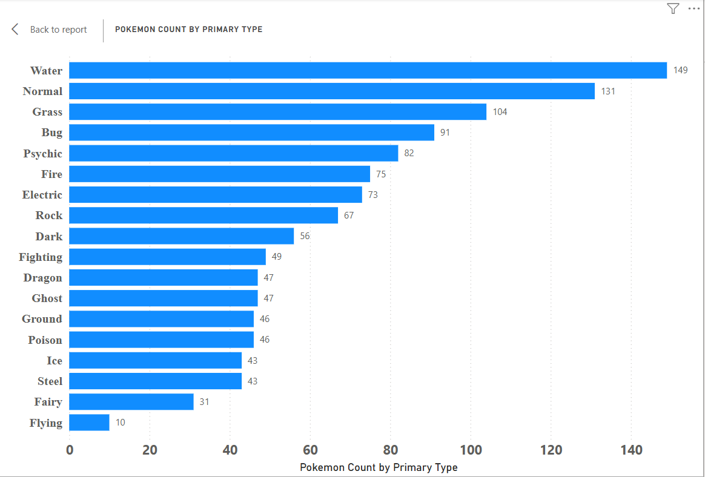
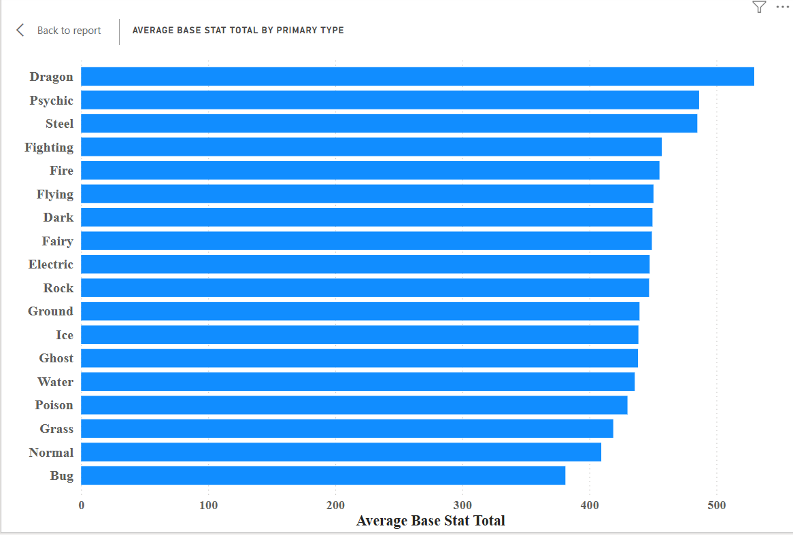
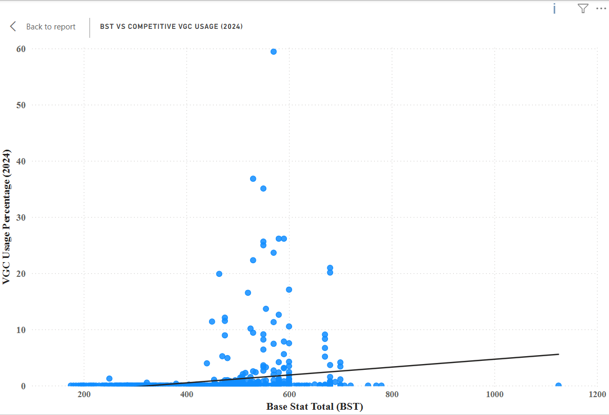

# Competitive Pokemon Analytics

This project explores competitive Pokémon statistics, team composition, and battle trends using SQL, Power BI, and Python.

## Goals
- Analyze Pokémon base stats and typing
- Explore competitive team-building trends
- Build interactive dashboards in Power BI
- Practice SQL querying and data visualization

## Tools Used
- SQL
- Power BI
- Python
- GitHub

## Pokemon Count by Primary Type

This visualization shows the distribution of Pokémon primary typings within the dataset. Water and Normal types appear most frequently, while Flying and Fairy are significantly less common as primary typings.

## Average Base Stat Total by Primary Type

This visualization compares the average base stat totals of Pokémon primary typings. Dragon, Psychic, and Steel types show the highest average statistical strength, while Bug and Normal types rank lower overall.

## Goal 1 Summary: Base Stat and Typing Analysis

The first phase of this project focused on analyzing Pokémon base stats and primary typings to identify broader statistical trends across the dataset. 

Initial findings revealed that Water and Normal types appear most frequently as primary typings, while Dragon, Psychic, and Steel types demonstrate the highest average Base Stat Totals (BST). These results suggest that typing frequency does not necessarily correlate with overall statistical strength.

By combining SQL aggregation, Power BI visualizations, and statistical comparisons, this phase established a foundational understanding of Pokémon type distribution and power scaling across the dataset.

With these baseline trends identified, the project will now transition toward competitive team-building analysis, exploring how stat distributions, typings, and role diversity contribute to successful competitive Pokémon teams.

## Question:
Do Pokémon with higher Base Stat Totals (BST) tend to see greater competitive usage in VGC formats?

## BST vs Competitive VGC Usage (2024)

### Analysis
While higher Base Stat Totals (BST) generally correlate with stronger competitive usage...While higher Base Stat Totals (BST) generally correlate with stronger competitive usage, the relationship is not absolute. Pokémon such as Flutter Mane demonstrate that typing, speed distribution, offensive pressure, and overall team utility can allow moderately statted Pokémon to outperform many statistically stronger alternatives in competitive VGC formats.

An extreme BST outlier was also identified in Eternamax Eternatus (BST 1125). While retained in the dataset for completeness, its unusually high statistical profile was considered separately when interpreting broader competitive trends.
